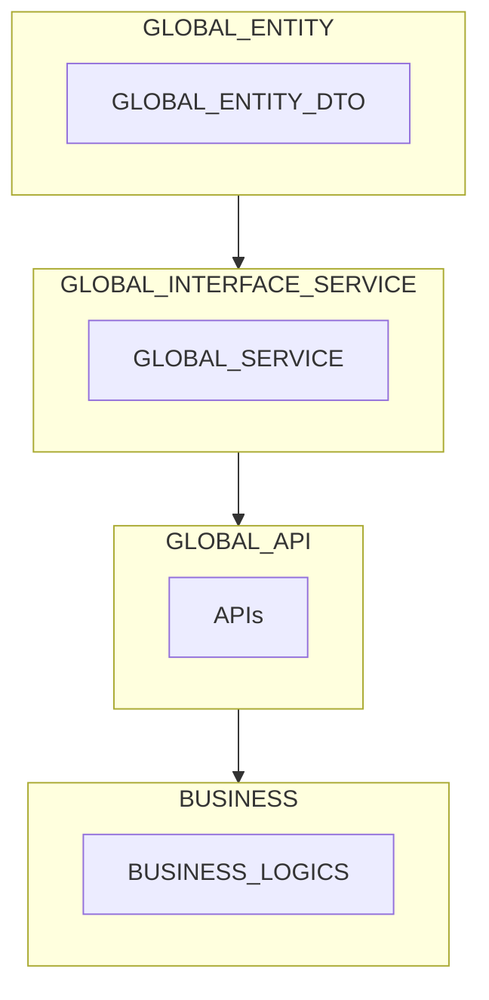

# 프로젝트 구조 


# 로컬 프로젝트 환경
- MySQL 8.2.0
- MongoDB
- Spring Boot 3.1.5
- Gradle 8.3
- JDK 17 (temurin-17-jdk)

# 멀티 모듈 프로젝트 

> 현재


현재 프로젝트 구조는 ArtifactId 를 동일하게 만들지 않아, 클래스를 가져다 쓸 수 없음.

> 수정안


groupId, artifactId 를 동일하게 생성하고, 루트 프로젝트에
`include('$프로젝트이름')` 작성 시, 상위 모듈을 주입받은 하위 모듈에서 엔티티를 사용할 수 있다.

## 멀티 모듈 실습 Github
- [Github URL](https://github.com/valorjj/multi-module-test.git)

# JIB

> Linux 환경이 아닌 MacOS 로컬 환경에서 테스트 위한 설정 필요

`platforms` 설정으로 `arm64` 옵션을 주지 않으면 맥 로컬 환경에서 실행 불가능.
```groovy
jib {
	from {
		image = 'amazoncorretto:17'
		platforms {
			platform {
				architecture = 'amd64'
				os = 'linux'
			}
			platform {
				architecture = 'arm64'
				os = 'linux'
			}
		}
	}
}
```

# Sleuth 대체

스프링 프레임워크 버전이 3.x.x 올라가며, `Sleuth` 는 더 이상 사용할 수 없다.
`Micrometer` 를 사용하면 된다. 

```groovy
		// -- Spring Actuator --
		implementation('org.springframework.boot:spring-boot-starter-actuator')
		// -- Micrometer --
		implementation('io.micrometer:micrometer-tracing-bridge-brave')
		// -- Zipkin --
		implementation('io.zipkin.reporter2:zipkin-reporter-brave')
```

```yaml


```